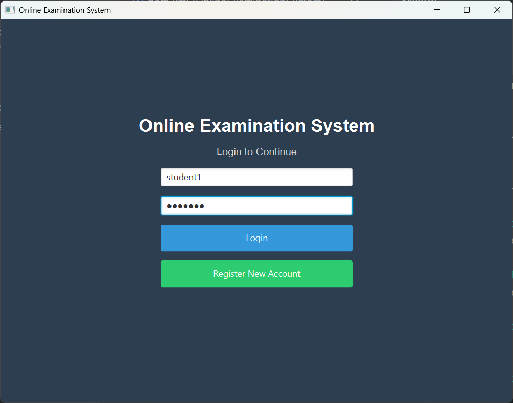
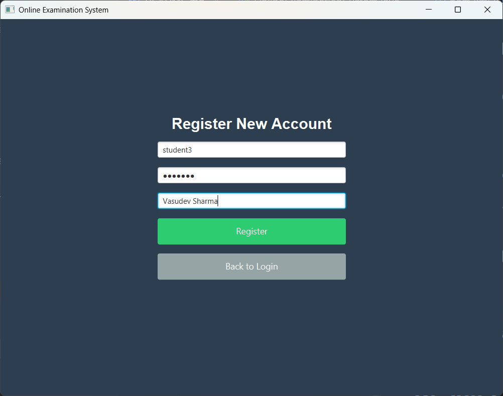
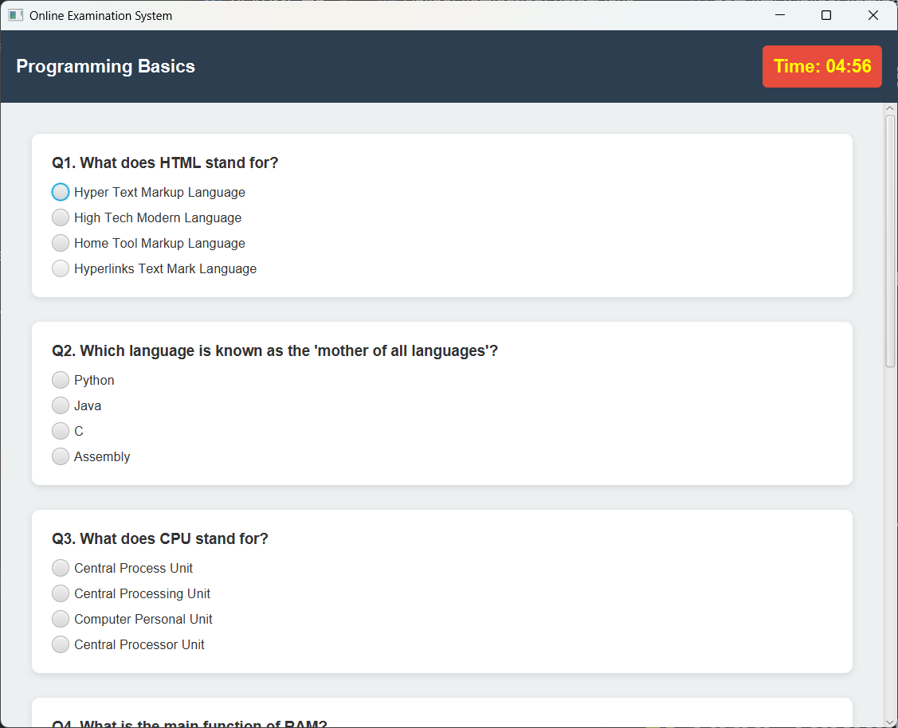
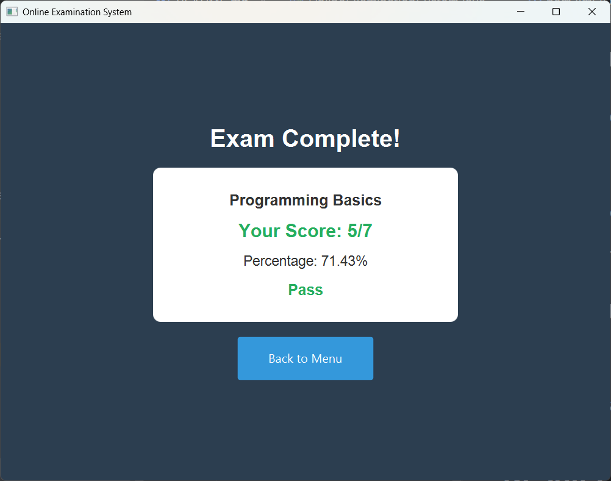

# 🖥️ Online Examination System
A JavaFX-based interactive examination platform built as part of the Oasis Infobyte Java Development Internship – Task 4.
This system allows students to register, log in, take MCQ-based exams with a timer, auto-submit functionality, and view results with grading.

---

## 📌 Project Overview
The Online Examination System simulates a fully-functional exam workflow, including:

- Student Registration
- Secure Login
- Profile Management
- Multiple Exams with MCQs
- Timer-Based Auto Submission
- Real-Time Result Processing
- Score History Display
- Password Update Functionality
- Logout & Session Handling

This project demonstrates practical knowledge of JavaFX UI development, event handling, object-oriented design, timers, and state management.

---

## 🎯 Functionalities (As per Task Requirements)

### ✔ Login
Students log in using a pre-created account or by registering.

### ✔ Update Profile and Password
Users can:
- Update full name
- Change password after identity verification

### ✔ Selecting Answers for MCQs
Each exam contains multiple questions with four options each.

### ✔ Timer and Auto Submit
- Countdown timer displayed on-screen
- Exam auto-submits when time runs out
- User can manually submit anytime

### ✔ Closing Session and Logout
Users can end the session and safely return to the login screen.

---

## 🔐 Demo Login Credentials

These accounts are preloaded inside the program:

### Student Account 1
Username: student1  
Password: pass123

### Student Account 2
Username: student2  
Password: pass456

Users may also register new accounts.

---

## 🧠 Exams Included

### 1️⃣ General Knowledge Quiz
5 mixed-knowledge MCQs  
Time: 3 minutes

### 2️⃣ Science Quiz
6 questions on physics, chemistry, biology  
Time: 4 minutes

### 3️⃣ Programming Basics
7 questions covering fundamentals of programming  
Time: 5 minutes

---

## 📁 Project Structure

| Path | Description |
|------|-------------|
| `OnlineExaminationSystem/` | Root project folder |
| ├── `pom.xml` | Maven build file |
| ├── `README.md` | Project documentation |
| ├── `.gitignore` | Git ignored files list |
| └── `src/` | Source code directory |
| &nbsp;&nbsp;&nbsp;&nbsp;└── `main/` | Main code base |
| &nbsp;&nbsp;&nbsp;&nbsp;&nbsp;&nbsp;&nbsp;&nbsp;└── `java/` | Java source root |
| &nbsp;&nbsp;&nbsp;&nbsp;&nbsp;&nbsp;&nbsp;&nbsp;&nbsp;&nbsp;&nbsp;&nbsp;└── `org/example/` | Package |
| &nbsp;&nbsp;&nbsp;&nbsp;&nbsp;&nbsp;&nbsp;&nbsp;&nbsp;&nbsp;&nbsp;&nbsp;&nbsp;&nbsp;&nbsp;&nbsp;├── `OnlineExaminationSystem.java` | Main JavaFX application |
| &nbsp;&nbsp;&nbsp;&nbsp;&nbsp;&nbsp;&nbsp;&nbsp;&nbsp;&nbsp;&nbsp;&nbsp;&nbsp;&nbsp;&nbsp;&nbsp;├── `User.java` | User model |
| &nbsp;&nbsp;&nbsp;&nbsp;&nbsp;&nbsp;&nbsp;&nbsp;&nbsp;&nbsp;&nbsp;&nbsp;&nbsp;&nbsp;&nbsp;&nbsp;├── `Question.java` | Question model |
| &nbsp;&nbsp;&nbsp;&nbsp;&nbsp;&nbsp;&nbsp;&nbsp;&nbsp;&nbsp;&nbsp;&nbsp;&nbsp;&nbsp;&nbsp;&nbsp;└── `Exam.java` | Exam model |

---

## 🛠 Technologies Used

| Technology | Purpose |
|-----------|----------|
| Java 17 | Core project development |
| JavaFX | GUI creation, layouts, and UI handling |
| Maven | Dependency and project management |
| JavaFX-Maven Plugin | Running the JavaFX application |
| IntelliJ IDEA | Development environment |

---

## ▶️ How to Run the Project

### 1️⃣ Clone the Repository
git clone https://github.com/YOUR-USERNAME/OIBSIP.git  
cd OIBSIP/OnlineExaminationSystem

### 2️⃣ Run Using Maven
mvn clean install  
mvn javafx:run

---

## 🧮 Scoring & Grading

After submission:

- Score is calculated instantly
- Percentage is shown
- Grade is assigned:

| Percentage | Grade |
|-----------|--------|
| 90%+ | Excellent |
| 75–89% | Good |
| 60–74% | Pass |
| <60% | Need Improvement |

User scores are saved for the duration of the session.

---

## 📸 Screenshots 

### 🔐 Login Screen

### 📝 Registration Screen

### 🧠 Exam Page

### 📊 Results Dashboard

---

## 🧩 Code Highlights

- Fully OOP-based architecture
- JavaFX for modern UI
- Timer-based exam auto-submission
- Real-time UI updates using Platform.runLater()
- Clean navigation between screens
- Multiple models: User, Exam, Question

---

## 📦 Future Enhancements

- Admin panel to manage exams and questions
- Database integration (MySQL or SQLite)
- Score export in PDF format
- Dark/Light themes
- Leaderboard functionality

---

## © License

Developed as part of the Oasis Infobyte Java Internship Program.  
You may modify or extend the project for learning or portfolio use.

---

## 🙋‍♂️ Author

**Vasudev Sharma**  
Java Developer | AI & Software Engineering Enthusiast
